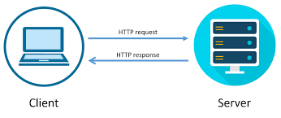

# API Requests
API stands for application programming interface, and it is how two or more pieces of software are able to communicate with one another.
### What is an API?
An API is a software intermediary that allows two applications to communicate using a set of definitions and protocols. 
APIs are an accessible way to extract and share data within and across organizations.

An everyday example of how an API is used is the weather app on your phone, your app "talks" to a Weather Channel system via APIs in order to show you daily weather updates.

An API is necessary for communication between two applications because those applications might not understand each other.
Suppose you have one person who speaks English and another who speaks French, but neither can speak each other's language, how are they supposed to communicate?
Via a translator who acts as an intermediary to the conversation.
That is somewhat the purpose of an API.

### What is HTTP Request and Response?
HTTP stands for Hypertext Transfer Protocol and is used to structure requests and responses over the internet.
HTTP requires data to be transferred from one point to another over the network.

An HTTP request is made by a client, to a named host, which is located on a server.
The aim of the request is to access a resource on the server.
To make the request, the client uses components of a URL, which includes the information needed to access the resource.
An HTTP response is made by a server to a client.
The aim of the response is to provide the client with the resource it requested, or inform the client that the action it requested has been carried out; or else to inform the client that an error occurred in processing its request.

### How Data is Represented in an API Call
Its all well and good to be able to get data from one place and direct it to another, but it is important that the data is formatted in a way that it can be understood. Let's go back to the translator example, the translator will be able to get the information from one person but will need to translate what was said for the second person, the same applies with two applications.
One application has to put the data in a format that the other will understand.
Generally, this means some kind of text format.
The most common formats found in modern APIs are JSON (JavaScript Object Notation) and XML (Extensible Markup Language).